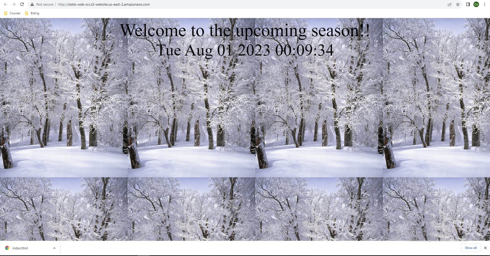

# Project: Recoverability In AWS
## Initial Steps
I. Download and Run Vpc.yaml file in CloudFormation
[Download and Run VPC yaml file](https://github.com/udacity/nd063-c2-design-for-availability-resilience-reliability-replacement-project-starter-template/blob/master/cloudformation/vpc.yaml)

II. For building the VPC. Do some the following steps:
1. Services -> CloudFormation
2. Create stack “With new resources (standard)”
3. Template is ready
4. Upload a template file
5. Click “Choose file” button
6. Select provided YAML file
7. Next  

 
8. Fill in Stack name
9. Name the VPC
10. Update the CIDR blocks
11. Click Next
12. Click Next again
13. Click Create stack
14. Wait for the stack to build out. Refresh until status becomes “CREATE_COMPLETE”
15. Observe the “Outputs” tab for the created IDs. These will be used later.
 

 

## Part 1 Data Durability And Recovery
#### Highly durable RDS Database
1. Primary VPC 
 

2. Secondary VPC 
 

3. Primary DB Config 
 

4. Secondary DB Config 
 

5. Primary DB SubnetsGroup 
 

6. Secondary DB SubnetsGroup 
 

7. Primary VPC Subnets 
 

8. Secondary VPC Subnets 
 

9. Primary Subnet Routing 
 

10. Secondary Subnet Routing 
 

#### Availability Estimate 
[See more detail at estimation link](./estimates.txt) 

#### Demonstrate normal usage 
[See more detail at log primary link](./logs/log_primary.txt) 

 

#### Monitor database 
1. Create an EC2 keypair in the region
2. Launch an Amazon Linux EC2 instance in the standby region. Configure the instance to use the VPC's public subnet and security group ("UDARR-Application").
3. SSH to the instance and connect to the read replica database.
4. Verify if you are not able to insert data into the database but are able to read from the database.
5. You have now demonstrated that you can only read from the read replica database.

Monitoring Connections 
 

Monitoring Replication 
 

## Part 2: Failover And Recovery
#### Failover And Recovery
 
 

6. Promote the read replica
7. Verify that if you are able to insert data into and read from the read replica database.
8. You have now demonstrated that you can read and write the promoted database in the standby region.

 
 

## Part 3: Web Resiliency
#### Website Resiliency

S3 Bucket 
 

S3 Original 
 

S3 Season 
 

S3 Season Revert 
 

S3 Delete Marker 
 

S3 Deletion 
 

S3 Delete Revert 
 